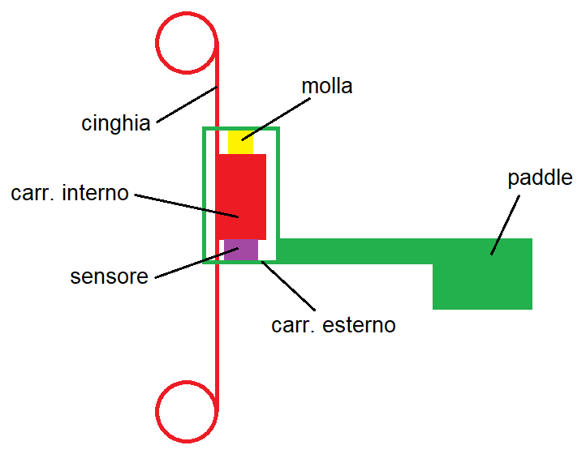

# Struttura compressore

La struttura del compressore può essere così rappresentata:

1. Il paddle è solidale al carrello esterno che si muove su due binari paralleli e verticali.
2. All'interno del carrello esterno, il carrello interno scorre attraverso due scanalature ricavate nel carrello esterno, in direzione parallela a quella del carrello esterno.
3. Il carrello interno è solidale alla cinghia azionata dal motore.
4. Nella parte inferiore del carrello interno è montato il sensore di pressione.
5. Nella parte superiore del carrello interno è montata una molla.
6. La molla controbilancia il peso dell'assieme verde (carrello esterno + paddle) che altrimenti, con il compressore sollevato, cadrebbe verso il basso distaccandosi dal sensore di pressione.
