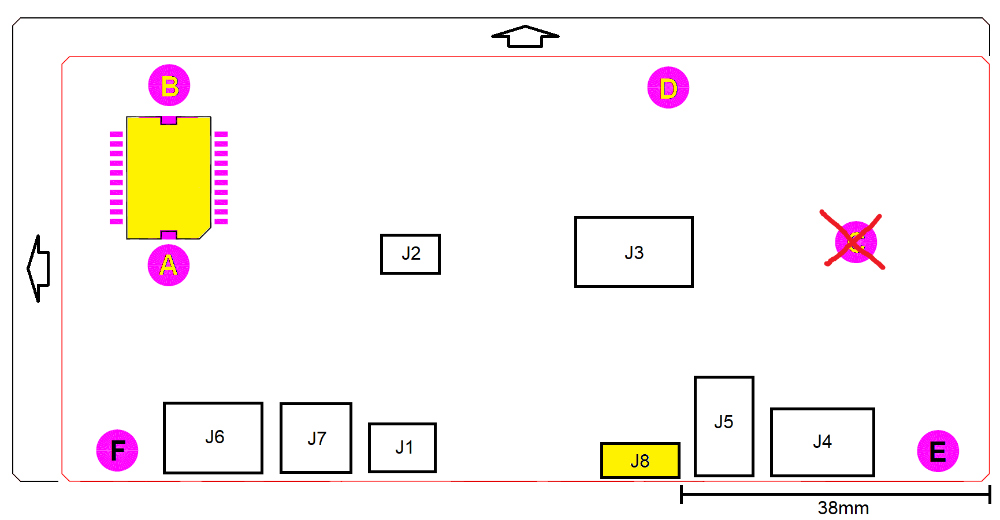

# Note di sbroglio

*Ultima modifica: 20/12/2022*

1. Il codice del circuito stampato è **CS/22-302-0**.

2. La struttura della scheda ricalca grosso modo quella della scheda 16-269-0. La serigrafia della nuova scheda sarà ruotata di 180° rispetto alla scheda 16-269-0.

3. Le dimensioni minime della scheda sono uguali a quelle della scheda 16-269-0, `121.3mm x 55.6mm` (contorno rosso), le dimensioni massime sono `130mm x 60mm` (contorno nero). L'estensione può avvenire verso sinistra e verso l'alto.

4. Il PCB ha spessore 1.6mm ed ha 4 strati.

5. La foratura della scheda 16-269-0 è rappresentata dai fori **A**, **B**, **C** e **D**. Nella nuova scheda verrà rimosso il foro **C** e si aggiungeranno i fori **E** e **F** posizionati lungo il bordo inferiore, ai lati dei connettori.

6. I connettori sono di seguito elencati:

    | Connettore | Etichetta | Tipo         | Descrizione                          |
    | -- | ------------- | ---------------- | ------------------------------------ |
    | J1 | `24VDC`       | [105311-1102]    | Alimentazione a 24V                  |
    | J2 | `SUPPLY_TEST` | [HEADER-3x2]     | Monitor alimentazioni scheda         |
    | J3 | `DEBUG`       | [61200621621]    | Interfaccia di programmazione        |
    | J4 | `HW_BUS`      | [105310-2210]    | Interfaccia Hardware Bus             |
    | J5 | `POSITION`    | [22-05-3031]     | Interfaccia  potenziometro posizione |
    | J6 | `MOTOR`       | [MC1,5/3-G-3,81] | Interfaccia motore                   |
    | J7 | `BRAKE`       | [MC1,5/2-G-3,81] | Interfaccia freno                    |
    | J8 | `PADDLE`      | [54548-1071]     | Interfaccia paddle                   |

    [105311-1102]: https://www.molex.com/pdm_docs/sd/1053111102_sd.pdf
    [61200621621]: https://www.we-online.com/catalog/datasheet/61200621621.pdf
    [105310-2210]: https://www.molex.com/pdm_docs/sd/1053101210_sd.pdf
    [22-05-3031]: https://www.molex.com/pdm_docs/sd/022053031_sd.pdf
    [MC1,5/3-G-3,81]: https://www.phoenixcontact.com/product/pdf/api/v1/MTgwMzI4MA?_realm=us&_locale=en-US&blocks=commercial-data%2Ctechnical-data%2Cdrawings
    [MC1,5/2-G-3,81]: https://www.phoenixcontact.com/product/pdf/api/v1/MTgwMzI3Nw?_realm=us&_locale=en-US&blocks=commercial-data%2Ctechnical-data%2Cdrawings
    [54548-1071]: https://www.molex.com/pdm_docs/sd/545482671_sd.pdf
    [HEADER-3x2]: https://www.molex.com/pdm_docs/sd/901310123_sd.pdf

7. I connettori **J1**, **J4**, **J5**, **J6**, **J7**, **J8** devono essere posizionati lungo il bordo inferiore della scheda.

8. Il connettore **J8** deve essere posizionato a 43mm (asse simmetria) dal bordo destro della scheda.

9. Il piano di massa **GND** deve essere solido e continuo, a meno eventualmente della net **CHASSIS_GND**.

10. I diodi TVS (**SMBJ\*A**, **SD05-\***) devono essere piazzati il più vicino possibile ai connettori associati.

11. La net **CHASSIS_GND**, (copper area?) deve essere posizionata lungo tutto il bordo inferiore e accogliere tutti gli anodi dei diodi TVS.

12. I fori **E** ed **F** devono essere connessi alla net **CHASSIS_GND** così come indicato nello schematico dai fori **MH1** e **MH2**. Il foro **MH1** sarà connesso a **GND** tramite **R6** il più vicino possibile al foro.

13. Riportare sulla serigrafia le etichette espresse dalla proprietà **COMMENT** dei componenti dello schematico, limitatamente ai connettori, ai testpoint e ai led. NON INCLUDERE LE PARENTESI QUADRE.

14. Piazzare i led sullo strato TOP.
