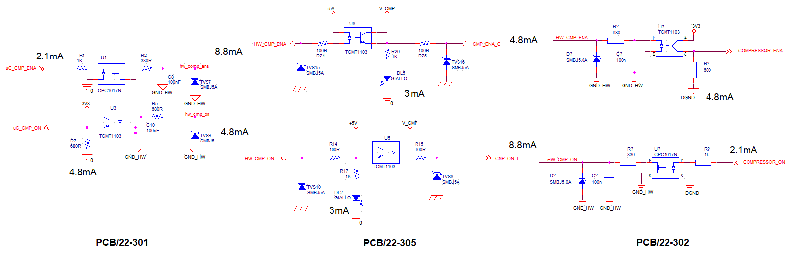
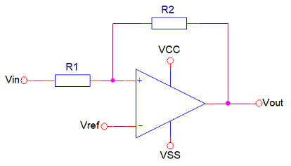
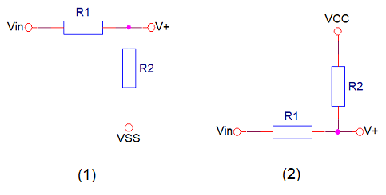
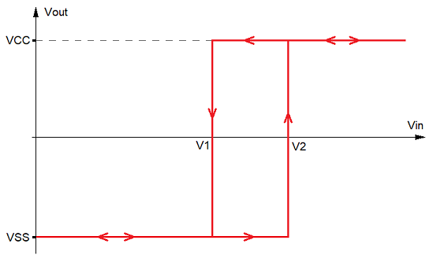

# PCB/22-302 - Progettazione

- [1. Requisiti](#1-requisiti)
  - [1.1. Alimentazione](#11-alimentazione)
  - [1.2. Elaborazione](#12-elaborazione)
  - [1.3. Comunicazione](#13-comunicazione)
  - [1.4. Azionamento](#14-azionamento)
  - [1.5. Gestione paddle](#15-gestione-paddle)
  - [1.6. Sicurezza](#16-sicurezza)
- [2. Implementazione](#2-implementazione)
  - [2.1. Dispositivi](#21-dispositivi)
    - [2.1.1. Motore](#211-motore)
    - [2.1.2. Freno di tenuta](#212-freno-di-tenuta)
    - [2.1.3. Sensore di forza](#213-sensore-di-forza)
    - [2.1.4. Potenziometro](#214-potenziometro)
  - [2.2. Connettori](#22-connettori)
  - [2.3. Alimentazione](#23-alimentazione)
  - [2.4. Processore](#24-processore)
    - [2.4.1. Revisione della scheda](#241-revisione-della-scheda)
  - [2.5. Comunicazione](#25-comunicazione)
    - [2.5.1. Interfaccia `HW_BUS`](#251-interfaccia-hw_bus)
    - [2.5.2. Interfaccia `PADDLE`](#252-interfaccia-paddle)
  - [2.6. Azionamento](#26-azionamento)
    - [2.6.1. Motore](#261-motore)
    - [2.6.2. Freno di tenuta](#262-freno-di-tenuta)
    - [2.6.3. Sensore di forza](#263-sensore-di-forza)
    - [2.6.4. Sensore di posizione](#264-sensore-di-posizione)
    - [2.6.5. Sensore di corrente](#265-sensore-di-corrente)
  - [2.7. Sicurezza](#27-sicurezza)
    - [2.7.1. Potenziometri](#271-potenziometri)
    - [2.7.2. Comparatori](#272-comparatori)
    - [2.7.3. Abilitazione della calibrazione](#273-abilitazione-della-calibrazione)
    - [2.7.4. Abilitazione del compressore](#274-abilitazione-del-compressore)
    - [2.7.5. Rilevazione della compressione](#275-rilevazione-della-compressione)
    - [2.7.6. Blocco della compressione](#276-blocco-della-compressione)
    - [2.7.7. Taglio dell'alimentazione del motore](#277-taglio-dellalimentazione-del-motore)
- [3. Documentazione](#3-documentazione)
  - [3.1. Componenti](#31-componenti)

## 1. Requisiti

Di seguito sono descritti tutti i requisiti a cui la progettazione della scheda PCB/22-302 è chiamata a soddisfare, così come sono stati definiti all'interno della documentazione qui sotto elencata:

- *Gantry Hardware Specification - Compressor Device*
- *Gantry Hardware Specification - Hardware Interfaces*

### 1.1. Alimentazione

La scheda PCB/22-302 riceve un'alimentazione in tensione continua a 24V direttamente dalla scheda servizi PCB/22-301, che ne garantisce la continuità tramite la funzione UPS.

### 1.2. Elaborazione

Le funzioni di controllo del compressore sono eseguite dalla scheda PCB/22-302 per mezzo di un microcontrollore a 32 bit, modello SAME51J20A, prodotto da Microchip, avente core ARM Cortex-M4 a 120MHz, e package TQFP a 64 pin.

### 1.3. Comunicazione

La scheda PCB/22-302 comunica con il sistema di elaborazione centrale, rappresentato dal *Gantry Control Unit*, per mezzo del *CAN Bus* a 1Mbps.

La scheda PCB/22-302 è inoltre connessa all'*Hardware Bus* proveniente dalla scheda PCB/22-305 (C-ARM Hub).

### 1.4. Azionamento

L'azionamento del compressore viene realizzato tramite il controllo di un motore a spazzole in corrente continua che movimenta il paddle di compressione, su un binario di scorrimento, per mezzo di una cinghia dentata.

Il controllo dell'azionamento è coadiuvato da un sensore di forza posto sul supporto del paddle e da un sensore potenziometrico che restituisce la posizione del carrello del paddle sul binario.

L'azionamento del compressore è comandato in vari modi:

- tramite comandi ricevuti dal *Gantry Control Unit* attraverso il *CAN Bus*;
- tramite appositi segnali dell'*Hardware Bus*;
- tramite interruttori incorporati nelle manopole per la compressione manuale ed integrate nel supporto del paddle.

### 1.5. Gestione paddle

Il paddle di compressione è un componente estraibile e sostituibile con diversi modelli. Il sistema deve conoscere se il paddle è presente e che tipo di paddle è installato.

L'elettronica di rilevamento e identificazione del paddle è situata sulla scheda PCB/22-306 (Paddle Device Board). Su tale scheda sono inoltre connessi il sensore di forza e i pulsanti di attivazione manuale integrati nelle manopole del compressore.

La scheda PCB/22-306 è connessa alla scheda PCB/22-302 e da questa riceve l'alimentazione.

### 1.6. Sicurezza

L'azionamento del motore del compressore deve tenere in conto l'informazione della pressione realizzata durante l'azionamento stesso.

La massima compressione realizzabile per via automatica, cioè eseguita dal firmware controllando il motore, è limitata a 200N. Tale limite deve essere garantito da un'opportuna elettronica, posta al di fuori del controllo del firmware, che impedisca ulteriori aumenti della pressione pur consentendo la decompressione.

Oltre l'azionamento automatico fino a un massimo di 200N, il sistema prevede l'intervento manuale per l'incremento della compressione fino a 300N. Anche questo secondo limite deve essere garantito dall'elettronica non controllata dal firmware e, in caso di violazione, deve provvedere al taglio completo della potenza dell'azionamento.

## 2. Implementazione

### 2.1. Dispositivi

#### 2.1.1. Motore

| Proprietà   | Valore                             |
| ----------- | ---------------------------------- |
| Produttore  | Soho Precision Machinery Co., Ltd. |
| Part number | `GBN50-4D-25068B-28Y-RC-RH`        |
| Codice MT   | MR-GBN50-4D-2                      |

- [SOHO homepage](http://sohomotor.com/index.html)
- [DC Gearmotors](../artifacts/datasheets/motore/soho/Compact-DC-Gearmotors-Product-Data-Sheet_v2.pdf)
- [7E4065B-28Y (DC Motor)](../artifacts/datasheets/motore/soho/7E4065.pdf)
- [GBN50 (Spur Gearhead)](../artifacts/datasheets/motore/soho/GBN50.pdf)

#### 2.1.2. Freno di tenuta

#### 2.1.3. Sensore di forza

| Proprietà   | Valore               |
| ----------- | -------------------- |
| Produttore  | TE Connectivity      |
| Part number | `FX293X-100A-0100-L` |
| Codice MT   | ???                  |

- [Product page](https://www.te.com/usa-en/product-CAT-FSE0006.html)
- [Datasheet](../artifacts/datasheets/sensore/te/FX29.pdf)

#### 2.1.4. Potenziometro

| Proprietà   | Valore         |
| ----------- | -------------- |
| Produttore  | Bourns         |
| Part number | `3590S-2-502L` |
| Codice MT   | ???            |

- [Product page](https://www.bourns.com/products/potentiometers/precision-pots-multiturn/product/3590)
- [Datasheet](../artifacts/datasheets/potenziometro/3590.pdf)

### 2.2. Connettori

| Connettore | Etichetta | Tipo         | Descrizione                          |
| -- | ------------- | ---------------- | ------------------------------------ |
| J1 | `24VDC`       | [105311-1102]    | Alimentazione a 24V                  |
| J2 | `SUPPLY_TEST` | [HEADER-3x2]     | Monitor alimentazioni scheda         |
| J3 | `DEBUG`       | [61200621621]    | Interfaccia di programmazione        |
| J4 | `HW_BUS`      | [105310-2210]    | Interfaccia Hardware Bus             |
| J5 | `POSITION`    | [22-05-3031]     | Interfaccia  potenziometro posizione |
| J6 | `MOTOR`       | [MC1,5/3-G-3,81] | Interfaccia motore                   |
| J7 | `BRAKE`       | [MC1,5/2-G-3,81] | Interfaccia freno                    |
| J8 | `PADDLE`      | [54548-1071]     | Interfaccia paddle                   |

[105311-1102]: https://www.molex.com/pdm_docs/sd/1053111102_sd.pdf
[61200621621]: https://www.we-online.com/catalog/datasheet/61200621621.pdf
[105310-2210]: https://www.molex.com/pdm_docs/sd/1053101210_sd.pdf
[22-05-3031]: https://www.molex.com/pdm_docs/sd/022053031_sd.pdf
[MC1,5/3-G-3,81]: https://www.phoenixcontact.com/product/pdf/api/v1/MTgwMzI4MA?_realm=us&_locale=en-US&blocks=commercial-data%2Ctechnical-data%2Cdrawings
[MC1,5/2-G-3,81]: https://www.phoenixcontact.com/product/pdf/api/v1/MTgwMzI3Nw?_realm=us&_locale=en-US&blocks=commercial-data%2Ctechnical-data%2Cdrawings
[54548-1071]: https://www.molex.com/pdm_docs/sd/545482671_sd.pdf
[HEADER-3x2]: https://www.molex.com/pdm_docs/sd/901310123_sd.pdf

### 2.3. Alimentazione

L'alimentazione viene fornita alla scheda tramite il connettore **J1** (`24VDC`):

| Pin | Segnale | Descrizione         |
| - | -------- | -------------------- |
| 1 | `IN_24V` | Ingresso linea a 24V |
| 2 | `IN_0V`  | Ingresso linea a 0V  |

L'alimentazione in ingresso viene posta in protezione tramite un fusibile **F1** da 5A, e filtrata con il filtro EMI **FLT1**, fornendo alla scheda la net di alimentazione `24V`.

A partire dall'alimentazione `24V`, tramite il regolatore switching **U1** ([R-78E-1.0]), viene generata l'alimentazione `5V`, per una corrente fino a 1A.

Dall'alimentazione `5V`, tramite il regolatore lineare **U2** ([NCP1117]), viene generata l'alimentazione `3V3`, per una corrente fino a 1A.

Le tre alimentazioni fornite alla scheda sono riportate sul connettore **J2** (`SUPPLY_TEST`) per agevolarne il test. Un partitore con rapporto 1:12 e applicato all'alimentazione `24V` produce il segnale `SUPPLY_MONITOR` in ingresso al microcontrollore.

### 2.4. Processore

Di seguito l'elenco dei segnali gestiti dal processore **U3** ([SAME51J20A]):

| Segnale           | Tipo | Direzione | Descrizione                                                   |
| ----------------- | :-------: | :--: | ------------------------------------------------------------- |
| `SUPPLY_MONITOR`  | analogico | I    | Partitore 1:12 dell'alimentazione `24V`                       |
| `COMPRESSOR_ENA`  | digitale  | I    | Abilitazione del compressore dall'HW_BUS                      |
| `COMPRESSOR_UP`   | digitale  | I    | Comando di decompressione dall'HW_BUS                         |
| `COMPRESSOR_DOWN` | digitale  | I    | Comando di compressione dall'HW_BUS                           |
| `CALIBRATION_ENA` | digitale  | I    | Abilitazione della calibrazione dall'HW_BUS                   |
| `BRIDGE_IN1`      | digitale  | O    | Controllo dell'half bridge 1 del driver motore                |
| `BRIDGE_IN2`      | digitale  | O    | Controllo dell'half bridge 2 del driver motore                |
| `BRIDGE_ENB`      | digitale  | O    | Abilitazione del driver motore                                |
| `BRIDGE_ENB_FB`   | digitale  | I    | Feedback dell'abilitazione del driver motore                  |
| `BRAKE_OFF`       | digitale  | O    | Comando di distacco del freno di tenuta                       |
| `MOTOR_CUT`       | digitale  | O    | Comando di interruzione dell'alimentazione del motore         |
| `CURRENT_SENSOR`  | analogico | I    | Segnale del sensore di corrente del motore                    |
| `POSITION_SENSOR` | analogico | I    | Segnale del sensore di posizione                              |
| `FORCE_SENSOR`    | analogico | I    | Segnale del sensore di forza                                  |
| `FORCE_OVF1`      | digitale  | I    | Overflow della 1° soglia del sensore di forza                 |
| `FORCE_OVF2`      | digitale  | I    | Overflow della 2° soglia del sensore di forza                 |
| `FORCE_OVF3`      | digitale  | I    | Overflow della 3° soglia del sensore di forza                 |
| `CURRENT_OVF`     | digitale  | I    | Overflow della soglia del picco di corrente del motore        |
| `PADDLE_PRESENT`  | digitale  | I    | Segnale di presenza paddle                                    |
| `PADDLE_UP`       | digitale  | I    | Comando di decompressione dalla scheda PADDLE                 |
| `PADDLE_DOWN`     | digitale  | I    | Comando di compressione dalla scheda PADDLE                   |
| `UART_RX`         | digitale  | I    | Linea di ricezione dell'UART connessa con la scheda PADDLE    |
| `UART_TX`         | digitale  | O    | Linea di trasmissione dell'UART connessa con la scheda PADDLE |
| `CAN_RX`          | digitale  | I    | Linea di ricezione del CAN bus                                |
| `CAN_TX`          | digitale  | O    | Linea di trasmissione del CAN bus                             |
| `I2C_SDA`         | digitale  | I/O  | Linea dati del bus I2C                                        |
| `I2C_SCL`         | digitale  | O    | Linea di clock del bus I2C                                    |
| `ACTIVITY`        | digitale  | O    | Controllo del led **DL4** (`CPU`)                             |
| `HW_REVISION`     | analogico | I    | Revisione della scheda                                        |

#### 2.4.1. Revisione della scheda

L'informazione della revisione della scheda è fornita al microcontrollore dal partitore {**R12**, **R13**} le cui resistenze variano a passi di $500\Omega$ e la cui somma è fissa a $4k\Omega$. In tal modo:

$$ V_{HW\_REVISION} = 3.3V * \frac{n}{8} \space,\space con \space 0 \le n \le 8 $$

### 2.5. Comunicazione

La scheda PCB/22-302 comunica con l'esterno attraverso i connettori **J4** (`HW_BUS`) e **J8** (`PADDLE`).

#### 2.5.1. Interfaccia `HW_BUS`

Il connettore **J4** fornisce le interfacce dell'hardware bus, propriamente detto, e del CAN Bus.

| Pin | Segnale        | Pin | Segnale     |
| --- | -------        | --- | ----------- |
| 1   | `HW_CAN_H`     | 6   | `HW_CAN_L`  |
| 2   | `HW_CAN_GND`   | 7   | nc          |
| 3   | `HW_CMP_ENA`   | 8   | `HW_CMP_UP` |
| 4   | `HW_CMP_DWN`   | 9   | `HW_CMP_ON` |
| 5   | `HW_CALIB_ENA` | 10  | `GND_HW`    |

Segue la descrizione dei segnali:

- `HW_CAN_H`     - \[I/O\] Linea dati alta del CAN bus
- `HW_CAN_L`     - \[I/O\] Linea dati bassa del CAN bus
- `HW_CAN_GND`   - Massa del CAN bus
- `HW_CMP_ENA`   - \[I\] Abilitazione dell'azionamento del compressore. E' utilizzato dal microcontrollore ma interviene anche direttamente sull'hardware di azionamento.
- `HW_CMP_UP`    - \[I\] Richiesta di decompressione. E' utilizzato dal solo microcontrollore.
- `HW_CMP_DWN`   - \[I\] Richiesta di compressione. E' utilizzato dal solo microcontrollore.
- `HW_CMP_ON`    - \[O\] Stato di compressione in essere. Viene attivato quando il sensore di forza rileva una forza superiore ad un'appropriata soglia. **Viene generato per via hardware**.
- `HW_CALIB_ENA` - \[I\] Abilitazione delle operazioni di calibrazione. Interviene direttamente sull'hardware di calibrazione.
- `GND_HW`       - Massa dell'hardware bus

I segnali `HW_CAN_H`, `HW_CAN_L` e `HW_CAN_GND` sono inoltrati verso il driver **U4** ([TJA1050T]) che fornisce al processore i segnali `CAN_TX` e `CAN_RX`.

I restanti segnali dell'hardware bus, di dinamica compresa in 5V, sono isolati otticamente, tramite **U5**, **U6**, **U7**, **U8** e **U9** ([TCMT1103] e [CPC1017N]), e accoppiati ai segnali della scheda `COMPRESSOR_ENA`, `COMPRESSOR_UP`, `COMPRESSOR_DOWN`, `CALIBRATION_ENA` e `FORCE_OVF1`,

Di seguito il dimensionamento delle polarizzazioni degli opto-isolatori.

- TCMT1103: $V_F = 1.2V$, $CTR = 100\% \div 200\%$ ($@ I_F = 10mA$)
- CPC1017N: $V_F = 1.2V$, $R_{ON} = 6.5\Omega$ ($@ I_F = 5mA$)

#### 2.5.2. Interfaccia `PADDLE`

Il connettore **J8** fornisce l'interfaccia verso la scheda PCB/22-306 (Paddle Device Board).

| Pin | Segnale        | Descrizione                                                        |
| --- | -------------- | ------------------------------------------------------------------ |
| 1   | `PAD_DVDD`     | Alimentazione a 5V della sezione digitale della scheda PCB/22-306  |
| 2   | `PAD_DGND`     | Massa della sezione digitale della scheda PCB/22-306               |
| 3   | `PAD_RX`       | \[O\] Linea di ricezione del lettore RFID                          |
| 4   | `PAD_TX`       | \[I\] Linea di trasmissione del lettore RFID                       |
| 5   | `PAD_PRESENT`  | \[I\] Presenza del paddle                                          |
| 6   | `PAD_UP`       | \[I\] Comando di decompressione                                    |
| 7   | `PAD_DOWN`     | \[I\] Comando di compressione                                      |
| 8   | `PAD_AVDD`     | Alimentazione a 5V della sezione analogica della scheda PCB/22-306 |
| 9   | `PAD_AGND`     | Massa della sezione analogica della scheda PCB/22-306              |
| 10  | `PADDLE_FORCE` | \[A\] Sensore di forza                                             |

I segnali digitali dell'interfaccia sono controllati nei loro fronti di salita allo scopo di limitare le emissioni attraverso il cablaggio verso la scheda PCB/22-306. A tale scopo le uscite sono filtrate attraverso un passa-basso RC con costante di tempo pari a 10us, mentre gli ingressi sono applicati al driver **U17** ([SN74HCS365]) con funzione di trigger di Schmidt al fine di ripristinare una veloce transizione dei segnali inoltrati verso il processore. La stessa procedura dovrà essere adottata sull'altro lato del cablaggio, cioè sulla scheda PCB/22-306.

### 2.6. Azionamento

L'azionamento del compressore viene realizzato per il tramite di un motore a spazzole in corrente continua controllato dal processore **U3** usando le informazioni fornite dai sensori di forza, di posizione e di corrente. In fase si arresto il motore è bloccato da un freno di tenuta.

#### 2.6.1. Motore

Il connettore **J6** (`MOTOR`) connette il motore al driver **U11** ([L6205PD]):

| Pin | Segnale | Descrizione             |
| --- | ------- | ----------------------- |
| 1   | `MOT1`  | Terminale 1 del motore  |
| 2   | -       | -                       |
| 3   | `MOT2`  | Terminale 2 del motore  |

Il driver **U11** contiene due ponti H completi (**A** e **B**) ed è configurato in modo che i semi-ponti del ponte **A** sono collegati in parallelo tra loro; lo stesso vale per il ponte **B**.

In tal modo il driver **U11** fornisce un ponte H completo con le seguenti caratteristiche:

- $R_{DS(ON)}$ : $0.15\Omega$
- Max RMS load current : $2.8A$
- OCD threshold : $5.6A$

I limiti di corrente corrispondono a quelli del singolo ponte H, ma la resistenza equivalente è dimezzata, consentendo una minore dissipazione di potenza.

Il modello di dissipazione è rappresentato dalla relazione

$$\ P_D = 2 \cdot R_H \cdot I_H^2 $$

dove

- $R_H$ rappresenta la resistenza equivalente del semi-ponte, comprensiva della quota di dissipazione dinamica, che ha un valore di circa $1.25\Omega$.
- $I_H$ rappresenta la corrente nel semi-ponte.

Ipotizzando una corrente massima nel motore pari a $I_{M,max}=1.5A$, la corrente in ciascun semi-ponte è pari alla metà di tale corrente, perciò

$$ P_{D,max} = 2 \cdot 1.25\Omega \cdot \left(\frac{1.5A}{2}\right)^2 = 1.4W $$

Il driver **U11** è provvisto di una piastrina di dissipazione (slug) nella faccia inferiore del contenitore. La resistenza termica tra giunzione e ambiente $R_{th,j-amb}$ può essere considerata compresa tra i valori:

- $30°C/W$ con lo slug saldato sul top e connesso da 16 vie al piano di massa, senza ulteriori aree di dissipazione.
- $62°C/W$ con lo slug non saldato.

La dissipazione della potenza massima $P_{M,max}$ comporta un innalzamento della temperatura di giunzione, rispetto all'ambiente, pari a:

$$ 42°C \lt \Delta T_{j-amb} \lt 87°C $$

comunque compatibile con i limiti del dispositivo.

Il driver **U11** è controllato dal processore per mezzo dei seguenti segnali:

| Segnale         | Descrizione                           |
| --------------- | ------------------------------------- |
| `BRIDGE_ENB_S`  | Abilitazione del driver               |
| `BRIDGE_ENB_FB` | Feedback dell'abilitazione del driver |
| `BRIDGE_IN1`    | Controllo del semi-ponte 1            |
| `BRIDGE_IN2`    | Controllo del semi-ponte 2            |

Il driver **U11** implementa la protezione contro la sovraccorrente. In caso di superamento della soglia $I_{OCD}$, l'abilitazione del driver viene forzata a massa, interrompendo l'alimentazione del motore. Il segnale `BRIDGE_ENB_FB` segnala tale evenienza al processore.

#### 2.6.2. Freno di tenuta

Il freno di tenuta resta bloccato fintanto che non viene alimentato. Il processore provvede a fornirgli la necessaria alimentazione tramite il segnale `BRAKE_OFF_S` che attiva il transistor **Q11**, sbloccando così il motore del compressore.

#### 2.6.3. Sensore di forza

Il sensore di forza è montato sulla scheda PCB/22-306 e fornisce la sua informazione attraverso l'interfaccia `PADDLE`. Il segnale `PADDLE_FORCE` fornito dal sensore ha una dinamica compresa tra 0.5V e 4.5V per valori della forza misurata compresi tra 0N e 500N.

Il segnale viene applicato ad un inseguitore di tensione e ridotto da un partitore con rapporto 2:3 per fornire al processore il segnale `FORCE_SENSOR`, la cui dinamica risulta quindi compresa tra 0.33V e 3V.

#### 2.6.4. Sensore di posizione

Il sensore di posizione è realizzato attraverso un potenziometro multigiri alimentato a 5V. Il segnale proveniente dal potenziometro viene applicato ad un inseguitore di tensione e ridotto da un partitore con rapporto 2:3 per fornire al processore il segnale `POSITION_SENSOR` avente dinamica compresa tra 0V e 3V.

#### 2.6.5. Sensore di corrente

Il sensore di corrente restituisce l'informazione della corrente che scorre all'interno del motore. Tale misura è utile a verificare l'informazione proveniente dal sensore di forza. Essendo infatti la coppia esercitata dal motore strettamente legata alla corrente che in esso scorre, il sensore di corrente rappresenta una preziosa ridondanza per il sensore di forza.

La misura parte dalla tensione `BRIDGE_SENS` presente ai capi della resistenza **R41** da $0.1\Omega/2W$, posta in serie al ponte H realizzato dal driver **U11** e collegata a massa.

Per una corrente massima di $I_{M,max}=1.5A$ la massima caduta di tensione su **R41** corrisponde a $V_{BRIDGE\_SENS,max}=150mV$, inoltre la massima dissipazione sarebbe $P_{R1,max}=225mW$, per cui una resistenza di $0.5W$ sarebbe stata sufficiente.

Il segnale `BRIDGE_SENS` viene filtrato (passa-basso RC con $\tau=100ns$) e amplificato con guadagno 10 per fornire al processore il segnale `CURRENT_SENSOR` avente massima dinamica di 1.5V.

Il segnale `CURRENT_SENSOR` viene inoltre applicato ad un rivelatore di picco la cui uscita `CURRENT_PEAK` viene utilizzata per la realizzazione di una sicurezza. Il rivelatore di picco presenta una costante di tempo per la carica pari a $\tau_c=10us$ e una costante di tempo per la scarica pari a $\tau_s=4ms$.

### 2.7. Sicurezza

Nella scheda sono implementate un numero di misure di sicurezza volte a ridurre l'impatto di eventuali condizioni di anomalia dovute principalmente a malfunzionamenti del firmware in esecuzione sul processore. A tale scopo queste sicurezze sono realizzate tramite soluzioni puramente hardware senza il coinvolgimento del processore.

Le sicurezze implementate sono governate essenzialmente dalle abilitazioni provenienti dall'hardware bus e da appositi comparatori che mettono a confronto le informazioni di forza e di corrente con soglie opportunamente configurate tramite potenziometri.

#### 2.7.1. Potenziometri

I potenziometri digitali **U13** e **U14** forniscono quattro soglie di tensione `VREF1`, `VREF2`, `VREF3` e `VREF4` comprese tra 0V e 3.3V.

Tali potenziometri sono controllati dal processore tramite il bus I2C. Di seguito sono indicati gli indirizzi sul bus dei due dispositivi:

| Dispositivo | Indirizzo bus I2C |
| --- | ---------- |
| U13 | `0101000b` |
| U14 | `0101001b` |

#### 2.7.2. Comparatori

Sulla scheda sono implementati quattro comparatori con isteresi. Tre di essi mettono a confronto il segnale `FORCE_SENSOR` con le soglie `VREF1`, `VREF2` e `VREF3` fornendo i segnali `FORCE_OVF1`, `FORCE_OVF2` e `FORCE_OVF3`. Il quarto comparatore confronta il segnale `CURRENT_PEAK` con la quarta soglia `VREF4` restituendo il segnale `CURRENT_OVF`.

I comparatori sono configurati per esprimere un'isteresi pari a 33mV, cioè pari a 1/100 della dinamica di alimentazione.

Di seguito la raffigurazione di un comparatore non invertente con isteresi:

A causa della reazione positiva si hanno due configurazioni stabili equivalenti:

1. La tensione sull'ingresso non invertente $V^+$ dell'opamp è **superiore** alla tensione di riferimento $V_{ref}$, comportando in uscita dell'opamp una tensione pari a $V_{CC}$.
2. La tensione sull'ingresso non invertente $V^+$ dell'opamp è **inferiore** alla tensione di riferimento $V_{ref}$, comportando in uscita dell'opamp una tensione pari a $V_{SS}$.

Di seguito gli schemi equivalenti delle due configurazioni:

Il passaggio tra le due configurazioni si ha quando $V_{in}$ è tale che $V^+=V_{ref}$.

Dalla prima configurazione, posto $V_{in}=V_1$, si ha:

$$ V^+ = V_{ref} $$

$$ V_1 + (V_{CC} - V_1) \frac{R_1}{R_1 + R_2} = V_{ref} $$

mentre dalla seconda configurazione, posto $V_{in}=V_2$, si ha:

$$ V^+ = V_{ref} $$

$$ V_{SS} + (V_2 - V_{SS}) \frac{R_2}{R_1 + R_2} = V_{ref} $$

Semplificando rispetto a $V_{ref}$ si ottiene:

$$ V_1 + (V_{CC} - V_1) \frac{R_1}{R_1 + R_2} = V_{SS} + (V_2 - V_{SS}) \frac{R_2}{R_1 + R_2} $$

$$ V_1(R_1 + R_2) + (V_{CC} - V_1)R_1 = V_{SS}(R_1 + R_2) + (V_2 - V_{SS})R_2 $$

$$ V_1R_1 + V_1R_2 + V_{CC}R_1 - V_1R_1 = V_{SS}R_1 + V_{SS}R_2 + V_2R_2 - V_{SS}R_2 $$

$$ V_1R_2 + V_{CC}R_1 = V_{SS}R_1 + V_2R_2 $$

$$ (V_{CC} - V_{SS})R_1 = (V_2 - V_1)R_2 $$

La larghezza di isteresi è quindi pari a:

$$ \Delta V = V_2 - V_1 = (V_{CC} - V_{SS})\frac{R_1}{R_2} $$

#### 2.7.3. Abilitazione della calibrazione

I potenziometri digitali hanno memoria non volatile e devono essere programmati in una apposita procedura di calibrazione. Allo scopo di impedire indebiti accessi da parte del processore durante il normale funzionamento applicativo, il segnale `CALIBRATION_ENA` fornito dall'interfaccia `HW_BUS` controlla l'accesso ai potenziometri. Se infatti tale segnale non è attivo, è attiva la protezione contro la scrittura dei dispositivi ($\overline{WP}=low$). Inoltre se `CALIBRATION_ENA` è inattivo, la linea `I2C_SCL` è forzata a massa tramite i transistor **Q12** e **Q13** (pagina SAFETY1).

#### 2.7.4. Abilitazione del compressore

Il controllo del motore e del freno di tenuta da parte del processore viene abilitato tramite il segnale `COMPRESSOR_ENA` proveniente dall'interfaccia `HW_BUS`. Se infatti tale segnale è basso i segnali `BRIDGE_ENB_S` e `BRAKE_OFF_S` sono forzati a massa tramite i transistor **Q14**, **Q15** e **Q16** (pagina SAFETY3).

#### 2.7.5. Rilevazione della compressione

La rilevazione di compressione in corso viene eseguita tramite la comparazione del segnale `FORCE_SENSOR` e la soglia `VREF1` opportunamente calibrata (pagina SAFETY2). Il segnale di uscita del comparatore `FORCE_OVF1` viene applicato al terminale `HW_CMP_ON` dell'interfaccia `HW_BUS` (pagina HARDWARE BUS).

#### 2.7.6. Blocco della compressione

La compressione gestita da firmware è limitata al raggiungimento dei 200N di forza. Una volta raggiunto tale valore il driver del motore viene bloccato nel verso della compressione ma resta attivo nel verso della decompressione.

Il raggiungimento del limite dei 200N viene rilevato tramite la comparazione del segnale `FORCE_SENSOR` e la soglia `VREF2` opportunamente calibrata (pagina SAFETY2). Il segnale di uscita del comparatore `FORCE_OVF2` viene applicato ai transitor **Q17** e **Q18** che forzano il segnale `BRIDGE_IN1_S` a 3.3V. In questa maniera il semi-ponte 1 del driver **U11** risulta bloccato nella accensione del lato alto non permettendo ulteriori azionamenti del motore nel verso della compressione (SAFETY3).

> Il cablaggio del motore sul connettore **J6** deve essere disegnato in maniera che il blocco del semi-ponte 1 effettivamente impedisca il movimento del motore nel verso della compressione e non il contrario.

#### 2.7.7. Taglio dell'alimentazione del motore

Come detto la compressione automatica è limitata a 200N, ma è consentita un'ulteriore compressione, eseguita manualmente su apposite manopole installate sul supporto del paddle. La compressione manuale è a sua volta limitata a 300N. Nel caso che fosse superato tale limite, l'alimentazione del motore sarebbe interrotta.

Anche qui, il raggiungimento del limite dei 300N viene rilevato tramite la comparazione del segnale `FORCE_SENSOR` e la soglia `VREF3` opportunamente calibrata (pagina SAFETY2). Il segnale di uscita del comparatore `FORCE_OVF3` viene applicato al circuito di interruzione dell'alimentazione del motore.

Il circuito di interruzione è implementato tramite il relè a stato solido **U12** ([CPC1916Y]) pilotato da un multi-vibratore bistabile composto dai transistor **Q8** e **Q9** (pagina MOTOR).

All'accensione della scheda, il multi-vibratore è forzato nello stato attivo tramite il condensatore **C37**. Esso viene disattivato dal segnale `FORCE_OVF3` tramite il transistor **Q6**, spegnendo il relè **U12** e disalimentando il motore. Per la riattivazione del multi-vibratore è necessario spegnere e riaccendere la scheda.

## 3. Documentazione

### 3.1. Componenti

**Optoelettronici**:

- Opto-isolatore : [TCMT1103]
- Relè stato solido : [CPC1017N]
- Relè stato solido : [CPC1916Y]

[TCMT1103]: https://www.vishay.com/docs/83510/tcmt1100.pdf
[CPC1017N]: https://www.ixysic.com/home/pdfs.nsf/www/CPC1017N.pdf/$file/CPC1017N.pdf
[CPC1916Y]: https://www.ixysic.com/home/pdfs.nsf/www/CPC1916Y.pdf/$file/CPC1916Y.pdf

**Attivi**:

- Diodo piccoli segnali : [1N4148WT]
- Diodo TVS 600W : [SMBJ5.0A, SMBJ5.0CA, SMBJ30A, SMBJ30CA][SMBJ]
- Diodo TVS 450W : [SD05-01FTG][SD05]
- Diodo LED giallo : [APT2012YC]
- Diodo LED verde : [APT2012SGC]
- Diodo LED blu : [APT2012QBC/D]
- Diodo LED rosso : [APT2012EC]
- Transistor N-MOSFET 220mA : [BSS138]
- Transistor N-MOSFET 1.3A : [ZXMS6004FF]
- Transistor P-MOSFET 180mA : [BSS84]

[1N4148WT]: https://www.diodes.com/assets/Datasheets/1N4148WT.pdf
[SMBJ]: https://www.littelfuse.com/~/media/electronics/datasheets/tvs_diodes/littelfuse_tvs_diode_smbj_datasheet.pdf.pdf
[SD05]: https://www.littelfuse.com/~/media/electronics/datasheets/tvs_diode_arrays/littelfuse_tvs_diode_array_sd_datasheet.pdf.pdf
[APT2012YC]: https://www.kingbrightusa.com/images/catalog/SPEC/APT2012YC.pdf
[APT2012SGC]: https://www.kingbrightusa.com/images/catalog/SPEC/APT2012SGC.pdf
[APT2012QBC/D]: https://www.kingbrightusa.com/images/catalog/SPEC/APT2012QBC-D.pdf
[APT2012EC]: https://www.kingbrightusa.com/images/catalog/SPEC/APT2012EC.pdf
[BSS138]: https://www.onsemi.com/pdf/datasheet/bss138-d.pdf
[BSS84]: https://www.onsemi.com/pdf/datasheet/bss84-d.pdf
[ZXMS6004FF]: https://www.diodes.com/assets/Datasheets/ZXMS6004FF.pdf

**Passivi**:

- Bobina d'arresto : [DLW32SH101XF2L]
- Fusibile : [SMD050F-2]
- Ferrite : [BLM18BD102SN1D]
- Quarzo : [ECS-.327-12.5-16-TR3]

[DLW32SH101XF2L]: https://www.murata.com/products/productdata/8804914298910/QFLC9127.pdf
[SMD050F-2]: https://www.littelfuse.com/~/media/electronics/product_specifications/resettable_ptcs/littelfuse_ptc_smd050f_2_product_specification.pdf.pdf
[BLM18BD102SN1D]: https://www.murata.com/en-us/products/productdata/8796738650142/ENFA0003.pdf
[ECS-.327-12.5-16-TR3]: https://ecsxtal.com/store/pdf/ECX-16.pdf

**Integrati**:

- Driver CAN bus : [TJA1050T]
- Driver motore : [L6205PD]
- CPU : [SAME51J20A]
- Regolatore 5V : [R-78E-1.0]
- Regolatore 3.3V : [NCP1117]
- Amplificatore operazionale : [MCP6004]
- Potenziometro digitale : [MCP4661]
- Driver trigger di Schmidt : [SN74HCS365]

[TJA1050T]: https://www.nxp.com/docs/en/data-sheet/TJA1050.pdf
[L6205PD]: https://www.st.com/content/ccc/resource/technical/document/datasheet/group1/7f/8a/6c/96/c8/24/49/f6/CD00002345/files/CD00002345.pdf/jcr:content/translations/en.CD00002345.pdf
[SAME51J20A]: https://ww1.microchip.com/downloads/en/DeviceDoc/SAM_D5x_E5x_Family_Data_Sheet_DS60001507G.pdf
[R-78E-1.0]: https://recom-power.com/pdf/Innoline/R-78E-1.0.pdf
[NCP1117]: https://www.onsemi.com/pdf/datasheet/ncp1117-d.pdf
[MCP6004]: https://ww1.microchip.com/downloads/en/DeviceDoc/MCP6001-1R-1U-2-4-1-MHz-Low-Power-Op-Amp-DS20001733L.pdf
[MCP4661]: https://ww1.microchip.com/downloads/aemDocuments/documents/OTH/ProductDocuments/DataSheets/22107B.pdf
[SN74HCS365]: https://www.ti.com/lit/ds/symlink/sn74hcs365.pdf
