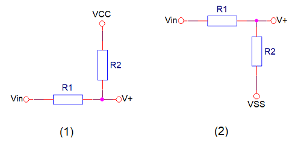

# PCB/22-302 - Progettazione

- [1. Requisiti](#1-requisiti)
  - [1.1. Alimentazione](#11-alimentazione)
  - [1.2. Elaborazione](#12-elaborazione)
  - [1.3. Comunicazione](#13-comunicazione)
  - [1.4. Azionamento](#14-azionamento)
  - [1.5. Gestione paddle](#15-gestione-paddle)
  - [1.6. Sicurezza](#16-sicurezza)
- [2. Implementazione](#2-implementazione)
  - [2.1. Dispositivi](#21-dispositivi)
    - [2.1.1. Motore](#211-motore)
    - [2.1.2. Sensore di forza](#212-sensore-di-forza)
    - [2.1.3. Potenziometro](#213-potenziometro)
  - [2.2. Connettori](#22-connettori)
  - [2.3. Alimentazione](#23-alimentazione)
  - [2.4. Azionamento](#24-azionamento)
  - [2.5. Comunicazione](#25-comunicazione)
    - [2.5.1. CAN Bus](#251-can-bus)
    - [2.5.2. Hardware Bus](#252-hardware-bus)
  - [2.6. Sicurezza](#26-sicurezza)
    - [2.6.1. Comparatori](#261-comparatori)
- [3. Documentazione](#3-documentazione)
  - [3.1. Componenti](#31-componenti)

## 1. Requisiti

Di seguito sono descritti tutti i requisiti a cui la progettazione della scheda PCB/22-302 è chiamata a soddisfare, così come sono stati definiti all'interno della documentazione qui sotto elencata:

- *Gantry Hardware Specification - Compressor Device*
- *Gantry Hardware Specification - Hardware Interfaces*

### 1.1. Alimentazione

La scheda PCB/22-302 riceve un'alimentazione in tensione continua a 24V direttamente dalla scheda servizi PCB/22-301, che ne garantisce la continuità tramite la funzione UPS.

### 1.2. Elaborazione

Le funzioni di controllo del compressore sono eseguite dalla scheda PCB/22-302 per mezzo di un microcontrollore a 32 bit, modello SAME51J20A, prodotto da Microchip, avente core ARM Cortex-M4 a 120MHz, e package TQFP a 64 pin.

### 1.3. Comunicazione

La scheda PCB/22-302 comunica con il sistema di elaborazione centrale, rappresentato dal *Gantry Control Unit*, per mezzo del *CAN Bus* a 1Mbps.

La scheda PCB/22-302 è inoltre connessa all'*Hardware Bus* proveniente dal *C-ARM Hub*.

### 1.4. Azionamento

L'azionamento del compressore viene realizzato tramite il controllo di un motore a spazzole in corrente continua che movimenta il paddle di compressione per mezzo di una cinghia dentata.

Il controllo dell'azionamento è coadiuvato da un sensore di forza posto sul supporto del paddle e da un sensore potenziometrico che restituisce la posizione del carrello del paddle sul binario di scorrimento.

L'azionamento del compressore è comandato in vari modi:

- tramite comandi ricevuti dal *Gantry Control Unit* attraverso il *CAN Bus*;
- tramite appositi segnali dell'*Hardware Bus*;
- tramite interruttori incorporati nelle manopole per la compressione manuale ed integrate nel supporto del paddle.

### 1.5. Gestione paddle

Il paddle di compressione è un componente estraibile e sostituibile con diversi modelli. Il sistema deve conoscere se il paddle è presente e che tipo di paddle è installato.

L'elettronica di rilevamento e identificazione del paddle è situata sulla scheda PCB/22-306 (Paddle Device Board). Su tale scheda sono inoltre connessi il sensore di forza e i pulsanti di attivazione manuale integrati nelle manopole del compressore.

La scheda PCB/22-306 è connessa alla scheda PCB/22-302 e da questa riceve l'alimentazione.

### 1.6. Sicurezza

L'azionamento del motore del compressore deve tenere in conto l'informazione della pressione realizzata durante l'azionamento stesso.

La massima compressione realizzabile per via automatica, cioè eseguita dal firmware controllando il motore, è limitata a 200N. Tale limite deve essere garantito da un'opportuna elettronica, posta al di fuori del controllo del firmware, che impedirà ulteriori aumenti pur consentendo la decompressione.

Oltre l'azionamento automatico fino a un massimo di 200N, il sistema prevede l'intervento manuale per l'incremento della compressione fino a 300N. Anche questo secondo limite deve essere garantito dall'elettronica non controllata dal firmware e, in caso di violazione, deve provvedere al taglio completo della potenza dell'azionamento.

---

## 2. Implementazione

### 2.1. Dispositivi

#### 2.1.1. Motore

| Proprietà   | Valore                             |
| ----------- | ---------------------------------- |
| Produttore  | Soho Precision Machinery Co., Ltd. |
| Part number | `GBN50-4D-25068B-28Y-RC-RH`        |
| Codice MT   | MR-GBN50-4D-2                      |

- [SOHO homepage](http://sohomotor.com/index.html)
- [DC Gearmotors](../artifacts/datasheets/motore/soho/Compact-DC-Gearmotors-Product-Data-Sheet_v2.pdf)
- [7E4065B-28Y (DC Motor)](../artifacts/datasheets/motore/soho/7E4065.pdf)
- [GBN50 (Spur Gearhead)](../artifacts/datasheets/motore/soho/GBN50.pdf)

#### 2.1.2. Sensore di forza

| Proprietà   | Valore               |
| ----------- | -------------------- |
| Produttore  | TE Connectivity      |
| Part number | `FX293X-100A-0100-L` |
| Codice MT   | ???                  |

- [Product page](https://www.te.com/usa-en/product-CAT-FSE0006.html)
- [Datasheet](../artifacts/datasheets/sensore/te/FX29.pdf)

#### 2.1.3. Potenziometro

| Proprietà   | Valore         |
| ----------- | -------------- |
| Produttore  | Bourns         |
| Part number | `3590S-2-502L` |
| Codice MT   | ???            |

- [Product page ](https://www.bourns.com/products/potentiometers/precision-pots-multiturn/product/3590)
- [Datasheet](../artifacts/datasheets/potenziometro/3590.pdf)

### 2.2. Connettori

| Connettore | Etichetta | Tipo         | Descrizione                          |
| -- | ------------- | ---------------- | ------------------------------------ |
| J1 | `24VDC`       | [105311-1102]    | Alimentazione a 24V                  |
| J2 | `SUPPLY_TEST` | HEADER-3x2       | Monitor alimentazioni scheda         |
| J3 | `DEBUG`       | [61200621621]    | Interfaccia di programmazione        |
| J4 | `HW_BUS`      | [105310-2210]    | Interfaccia Hardware Bus             |
| J5 | `POSITION`    | [22-05-3031]     | Interfaccia  potenziometro posizione |
| J6 | `MOTOR`       | [MC1,5/3-G-3,81] | Interfaccia motore                   |
| J7 | `BRAKE`       | [MC1,5/2-G-3,81] | Interfaccia freno                    |
| J8 | `PADDLE`      | [54548-1071]     | Interfaccia paddle                   |

[105311-1102]: https://www.molex.com/pdm_docs/sd/1053111102_sd.pdf
[61200621621]: https://www.we-online.com/catalog/datasheet/61200621621.pdf
[105310-2210]: https://www.molex.com/pdm_docs/sd/1053101210_sd.pdf
[22-05-3031]: https://www.molex.com/pdm_docs/sd/022053031_sd.pdf
[MC1,5/3-G-3,81]: https://www.phoenixcontact.com/product/pdf/api/v1/MTgwMzI4MA?_realm=us&_locale=en-US&blocks=commercial-data%2Ctechnical-data%2Cdrawings
[MC1,5/2-G-3,81]: https://www.phoenixcontact.com/product/pdf/api/v1/MTgwMzI3Nw?_realm=us&_locale=en-US&blocks=commercial-data%2Ctechnical-data%2Cdrawings
[54548-1071]: https://www.molex.com/pdm_docs/sd/545482671_sd.pdf

### 2.3. Alimentazione

### 2.4. Azionamento

> **N.B.**
>
> - Prevedere l'opzione del freno del motore
> - Calibrare offset e guadagno del sensore via firmware
>

### 2.5. Comunicazione

#### 2.5.1. CAN Bus

#### 2.5.2. Hardware Bus

Il connettore J?, modello 105310-2210, fornisce segnali isolati, di dinamica compresa in 5V.

Tutti i segnali sono instradati verso il microcontrollore. Alcuni di essi esercitano azione diretta sull'hardware di sicurezza.

| Pin | Segnale | Descrizione |
| --- | ------- | ----------- |
| 1  | `CANH`    | Linea dati alta del CAN bus |
| 6  | `CANL`    | Linea dati bassa del CAN bus |
| 2  | `CAN_GND` | Massa del CAN bus |
| 7  | - | - |
| 3  | `HW_CMP_ENA`   | **[IN]** Abilitazione dell'azionamento del compressore. E' utilizzato dal microcontrollore ma interviene anche direttamente sull'hardware di azionamento. |
| 8  | `HW_CMP_UP`    | **[IN]** Richiesta di attivazione del compressore nella direzione di decompressione. E' utilizzato dal solo microcontrollore. |
| 4  | `HW_CMP_DWN`   | **[IN]** Richiesta di attivazione del compressore nella direzione di compressione. E' utilizzato dal solo microcontrollore. |
| 9  | `HW_CMP_ON`    | **[OUT]** Stato di compressione in essere. Viene attivato quando il sensore di forza rileva una forza superiore ad un'appropriata soglia. **Viene generato per via hardware**. |
| 5  | `HW_CALIB_ENA` | **[IN]** Abilitazione delle operazioni di calibrazione. Interviene direttamente sull'hardware di calibrazione. |
| 10 | `GND_HW`       | Massa dell'hardware bus |

Di seguito il dimensionamento delle polarizzazioni degli opto-isolatori.

- TCMT1103: $V_F = 1.2V$, $CTR = 100\% \div 200\%$ ($@ I_F = 10mA$)
- CPC1017N: $V_F = 1.2V$, $R_{ON} = 6.5\Omega$ ($@ I_F = 5mA$)

### 2.6. Sicurezza

#### 2.6.1. Comparatori

Di seguito la raffigurazione di un comparatore non invertente con isteresi:

A causa della reazione positiva si hanno due configurazioni stabili equivalenti:

1. La tensione sull'ingresso non invertente $V^+$ dell'opamp è **inferiore** alla tensione di riferimento $V_{ref}$, comportando in uscita dell'opamp una tensione pari a $V_{SS}$.
2. La tensione sull'ingresso non invertente $V^+$ dell'opamp è **superiore** alla tensione di riferimento $V_{ref}$, comportando in uscita dell'opamp una tensione pari a $V_{CC}$.

Il passaggio tra le due configurazioni si ha quando $V_{in}$ è tale che $V^+=V_{ref}$.

Dalla prima configurazione, posto $V_{in}=V_2$, si ha:

$$ V^+ = V_{ref} $$

$$ V_{SS} + (V_2 - V_{SS}) \frac{R_2}{R_1 + R_2} = V_{ref} $$

mentre dalla seconda configurazione, posto $V_{in}=V_1$, si ha:

$$ V^+ = V_{ref} $$

$$ V_1 + (V_{CC} - V_1) \frac{R_1}{R_1 + R_2} = V_{ref} $$

Semplificando rispetto a $V_{ref}$ si ottiene:

$$ V_{SS} + (V_2 - V_{SS}) \frac{R_2}{R_1 + R_2} = V_1 + (V_{CC} - V_1) \frac{R_1}{R_1 + R_2} $$

$$ V_{SS}(R_1 + R_2) + (V_2 - V_{SS})R_2 = V_1(R_1 + R_2) + (V_{CC} - V_1)R_1 $$

$$ V_{SS}R_1 + V_{SS}R_2 + V_2R_2 - V_{SS}R_2 = V_1R_1 + V_1R_2 + V_{CC}R_1 - V_1R_1 $$

$$ V_{SS}R_1 + V_2R_2 = V_1R_2 + V_{CC}R_1 $$

$$ (V_2 - V_1)R_2 = (V_{CC} - V_{SS})R_1 $$

La larghezza di isteresi è quindi pari a:

$$ \Delta V = V_2 - V_1 = (V_{CC} - V_{SS})\frac{R_1}{R_2} $$

---

## 3. Documentazione

### 3.1. Componenti

**Optoelettronici**:

- [TCMT1103]
- [CPC1017N]
- [CPC1916Y]

[TCMT1103]: https://www.vishay.com/docs/83510/tcmt1100.pdf
[CPC1017N]: https://www.ixysic.com/home/pdfs.nsf/www/CPC1017N.pdf/$file/CPC1017N.pdf
[CPC1916Y]: https://www.ixysic.com/home/pdfs.nsf/www/CPC1916Y.pdf/$file/CPC1916Y.pdf

**Connettori**:

- DC_5V : [MC1,5/2-G-3,81]
- DC_12V : [MC1,5/3-G-3,81]
- DC_24V : [MSTBA2,5/2-G-5,08]
- HW_BUS : [0-338069-8]
- CAN_BUS : [98414-G06-10LF]
- SWD : [61200621621]

[MC1,5/2-G-3,81]: https://www.phoenixcontact.com/en-us/products/pcb-header-mc-15-2-g-381-1803277
[MC1,5/3-G-3,81]: https://www.phoenixcontact.com/en-us/products/pcb-header-mc-15-3-g-381-1803280
[MSTBA2,5/2-G-5,08]: https://www.phoenixcontact.com/en-us/products/pcb-header-mstba-25-2-g-508-1757242
[0-338069-8]: https://www.te.com/commerce/DocumentDelivery/DDEController?Action=srchrtrv&DocNm=338069&DocType=Customer+Drawing&DocLang=English
[98414-G06-10LF]: https://cdn.amphenol-cs.com/media/wysiwyg/files/drawing/98414.pdf
[61200621621]: https://www.we-online.com/catalog/datasheet/61200621621.pdf

**Attivi**:

- TVS : [SMBJ5.0A, SMBJ5.0CA, SMBJ30A, SMBJ30CA][SMBJ]
- LED giallo : [APT2012YC]
- LED verde : [APT2012SGC]
- LED blu : [APT2012QBC/D]
- LED rosso : [APT2012EC]
- N-MOSFET 220mA : [BSS138K]
- P-MOSFET 180mA : [DMP510DL]
- N-MOSFET 1.3A : [ZXMS6004FF]

[SMBJ]: https://www.littelfuse.com/~/media/electronics/datasheets/tvs_diodes/littelfuse_tvs_diode_smbj_datasheet.pdf.pdf
[APT2012YC]: https://www.kingbrightusa.com/images/catalog/SPEC/APT2012YC.pdf
[APT2012SGC]: https://www.kingbrightusa.com/images/catalog/SPEC/APT2012SGC.pdf
[APT2012QBC/D]: https://www.kingbrightusa.com/images/catalog/SPEC/APT2012QBC-D.pdf
[APT2012EC]: https://www.kingbrightusa.com/images/catalog/SPEC/APT2012EC.pdf
[BSS138K]: https://www.onsemi.com/pdf/datasheet/bss138k-d.pdf
[DMP510DL]: https://www.diodes.com/assets/Datasheets/DMP510DL.pdf
[ZXMS6004FF]: https://www.diodes.com/assets/Datasheets/ZXMS6004FF.pdf

**Passivi**:

- [DLW32SH101XF2L]
- [SMD050F-2]
- [BLM18BD102SN1D]
- Quarzo : [ECS-.327-12.5-16-TR3]

[DLW32SH101XF2L]: https://www.murata.com/products/productdata/8804914298910/QFLC9127.pdf
[SMD050F-2]: https://www.littelfuse.com/~/media/electronics/product_specifications/resettable_ptcs/littelfuse_ptc_smd050f_2_product_specification.pdf.pdf
[BLM18BD102SN1D]: https://www.murata.com/en-us/products/productdata/8796738650142/ENFA0003.pdf
[ECS-.327-12.5-16-TR3]: https://ecsxtal.com/store/pdf/ECX-16.pdf

**Integrati**:

- Driver CAN bus : [TJA1050T/CM,118]
- Driver motore : [L6205]
- CPU : [ATSAME51J20A-AU]
- Regolatore 3.3V : [NCP1117DT33T5G]
- Opamp : [MCP6004-I/ST]
- Pot digitale : [MCP4661-503E/ST]

[TJA1050T/CM,118]: https://www.nxp.com/docs/en/data-sheet/TJA1050.pdf
[L6205]: https://www.st.com/content/ccc/resource/technical/document/datasheet/group1/7f/8a/6c/96/c8/24/49/f6/CD00002345/files/CD00002345.pdf/jcr:content/translations/en.CD00002345.pdf
[ATSAME51J20A-AU]: https://ww1.microchip.com/downloads/en/DeviceDoc/SAM_D5x_E5x_Family_Data_Sheet_DS60001507G.pdf
[NCP1117DT33T5G]: https://www.onsemi.com/pdf/datasheet/ncp1117-d.pdf
[MCP6004-I/ST]: https://ww1.microchip.com/downloads/en/DeviceDoc/MCP6001-1R-1U-2-4-1-MHz-Low-Power-Op-Amp-DS20001733L.pdf
[MCP4661-503E/ST]: https://ww1.microchip.com/downloads/aemDocuments/documents/OTH/ProductDocuments/DataSheets/22107B.pdf
